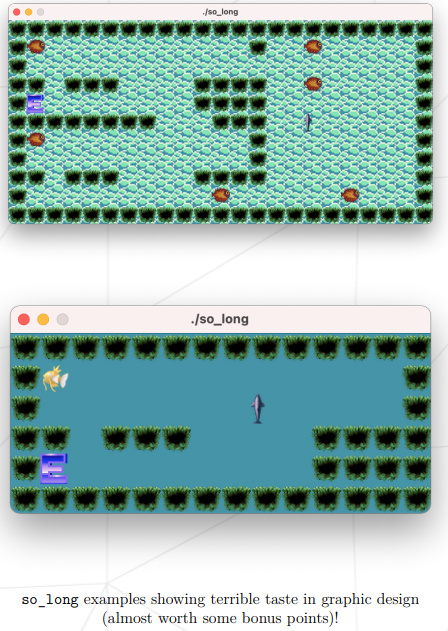
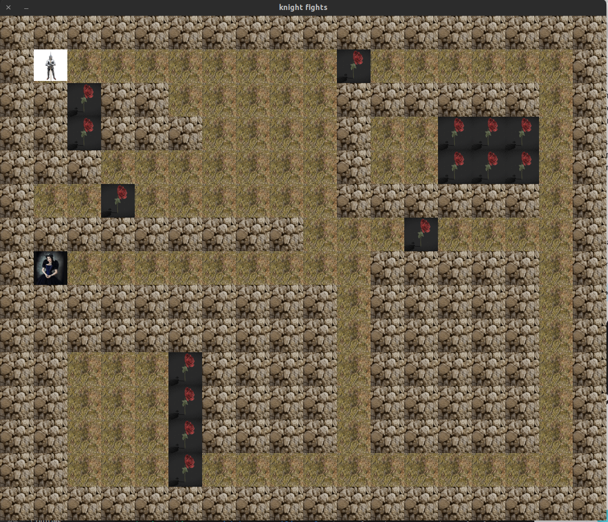
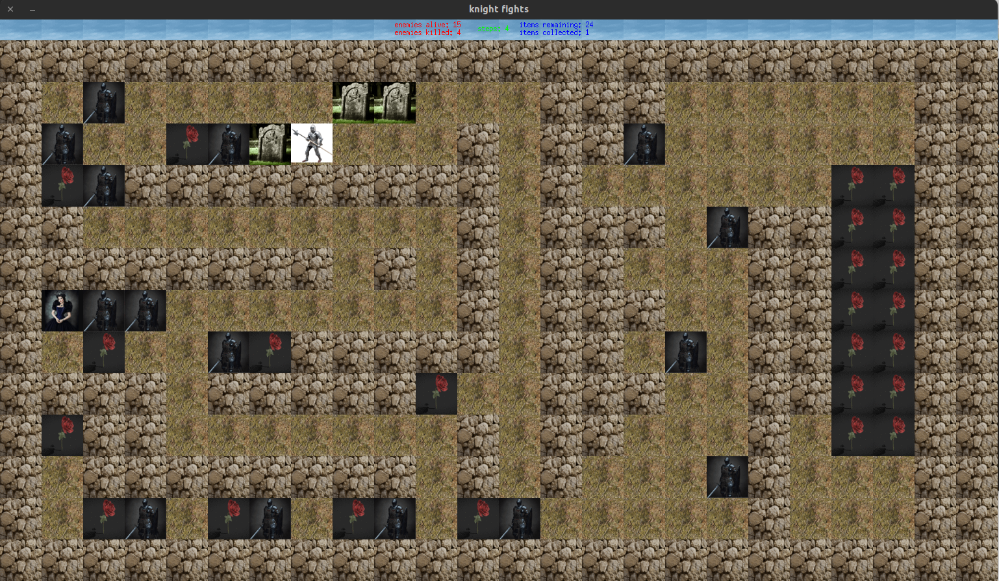

# push_swap
## Foreword
- Being a developer is a great thing for creating my own game.
    - But a good game needs some good assets. In order to create 2D games, I had to search for tiles, tilesets, sprites, and sprite sheets.
    - Fortunately, some talented artists are willing to share their works on platforms like: itch.io
    - In any case, I try to respect other people’s work
## Objectives
- It’s time for me to create a basic computer graphics project!
    - so long helped me improve your skills in the following areas: window management, event handling, colors, textures, and so forth.
    - I was going to use the school graphical library: the MiniLibX! This library was developed internally and includes basic necessary tools to open a window, create images and deal with keyboard and mouse events.
    - The other goals are similar to every other goal for this first year: being rigorous, level up in C programming, use basic algorithms, do some information research, and so forth.
## Examples

## My Game - mandatory part

## My Game - bonus part

#### Please read the [***Subject File***](https://cdn.intra.42.fr/pdf/pdf/68555/en.subject.pdf)